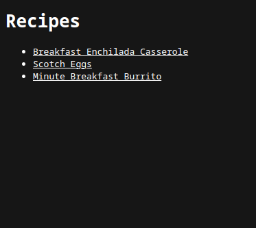
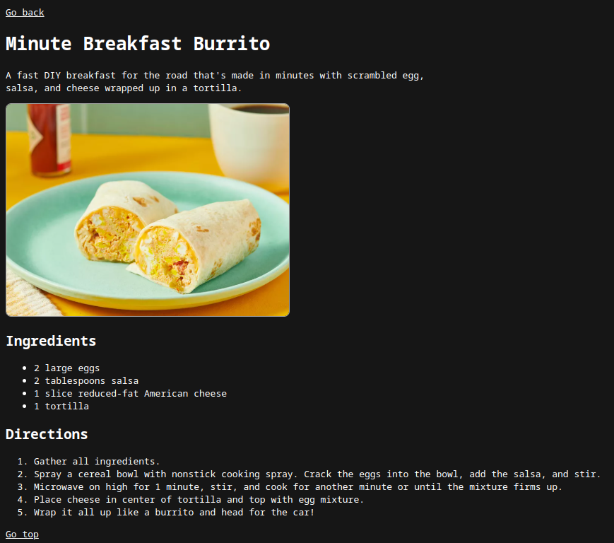

# Recipes

## Description
Simple website about food recipes, made with HTML and CSS as a basic practice of these 2 technologies, This project belongs to the foundations section of [The Odin Project](https://www.theodinproject.com) course.

## Demo

  

 

  

## Resources
- [All Recipes](https://www.allrecipes.com/)